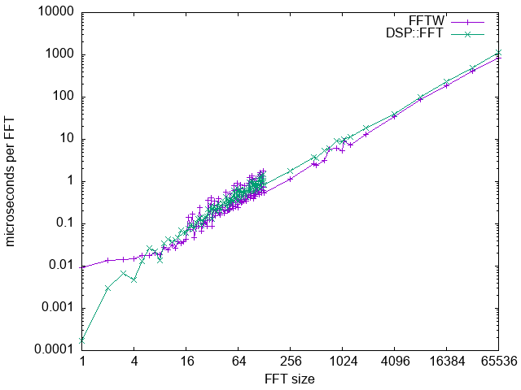
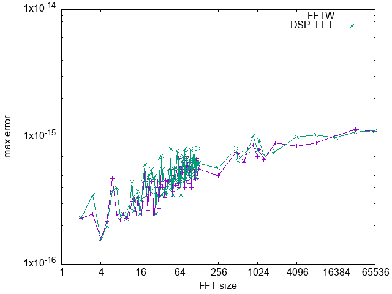

Contesting the mixed-radix [decimation-in-time](https://en.wikipedia.org/wiki/Cooley%E2%80%93Tukey_FFT_algorithm) [fast Fourier transform](https://en.wikipedia.org/wiki/Fast_Fourier_transform) implementation of [DSP](https://github.com/aicodix/dsp)::[FFT](https://github.com/aicodix/dsp/blob/master/fft.hh)

First of all, why use [DSP](https://github.com/aicodix/dsp)::[FFT](https://github.com/aicodix/dsp/blob/master/fft.hh) when there are already other popular implementations?

* Works in [WebAssembly](https://en.wikipedia.org/wiki/WebAssembly). See [example2](https://www.aicodix.de/example2/) for [DSP](https://github.com/aicodix/dsp)::[FFT](https://github.com/aicodix/dsp/blob/master/fft.hh) in action.
* License is [0BSD](https://landley.net/toybox/license.html).
* Easy to include in your project.
* Fast enough.

The only restriction of [DSP](https://github.com/aicodix/dsp)::[FFT](https://github.com/aicodix/dsp/blob/master/fft.hh) is its size, which must be a composite number of:

N = 2^a * 3^b * 5^c * 7^d * 11^e * 13^f * 17^g * 19^h * 23^i * 29^j * 31^k

Comparing double precision performance with various FFT sizes:



More calculations mean larger errors but fortunately they do not grow that fast with increasing FFT size:



The above images are made from [data.txt](data.txt) using [gnuplot.txt](gnuplot.txt):

```
./benchmark > data.txt
gnuplot gnuplot.txt
```

